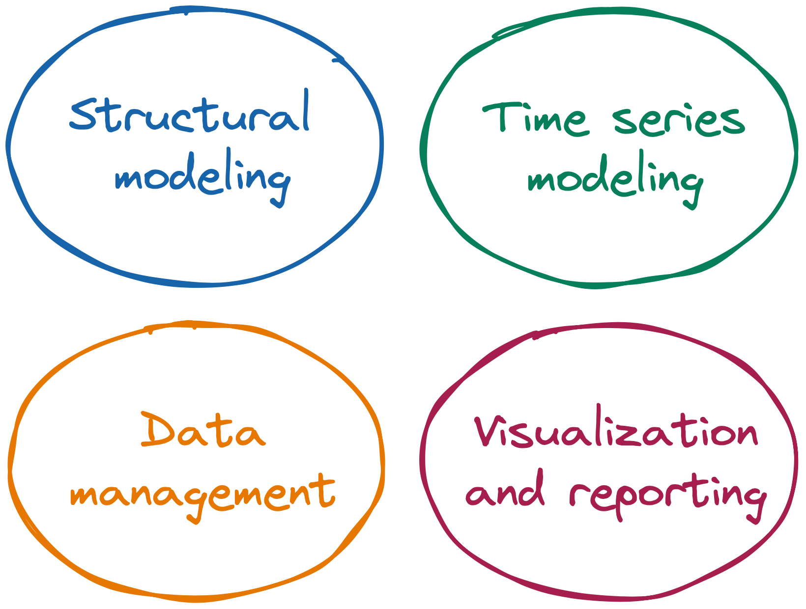

__[IrisToolbox] for Macroeconomic Modeling__

# Key functional areas 

`jaromir.benes@iris-toolbox.com`

---

---

## Overview of structural modeling tools

Develop and operate systems of structured equations

* Structural models: `Model` objects

* Systems of explanatory equations: `Explanatory` objects

* IrisT source language and preparser for writing model source codes

* Simulation plans, conditioning, and model inversions: `Plan` objects

* General time-varying state space: `LinearSystem` objects

* Bayesian estimation: `+distribution`, `Posterior`, `SystemProperty`, `SystemPrior`

---

## Overview of time series modeling tools

Explore shorter-term empirical correlations, deal with the overfitting problem in high-dimensional models

* Reduced-form vector autoregressions: `VAR` objects

* Panel vector autoregressions: `VAR` objects with panel groups

* Structural vector autoregressions: `SVAR`

* Prior dummy observations for bayesian VARs: `+dummy`

* Dynamic factor models: `Dynafit`

* Interface to `X13-Arima-Tramo-Seats`: `x13.season`

* Univariate filters for time series objects

---

## Overview of data management

Preprocess and postprocess time series and databanks (structs)

* Dates convenient for evenly spaced periodicities (daily, business-daily, weekly, monthly, quarterly, half-yearly, yearly, integer): `Dater` objects, `dater` package

* Time series (dynamic non-frame) manipulation: `Series` objects

* Databanks, batch jobs, import/export from common formats: `databank` package

* Customizable databank serialization to `json`, `csv` formats

* Interface to public database APIs: `databank.fromIMF`, `databank.fromECB`, `databank.fromFred` subpackages

---

## Overview of visualization and reporting

Visualize data on screen and create HTML reports

* Structured on-screen charting: `databank.Chartpack`

* Standalone reports based on HTML/JS/CSS/JSON technology: `+rephrase`

* Utilities for styling on-screen visualization: `+visual`

