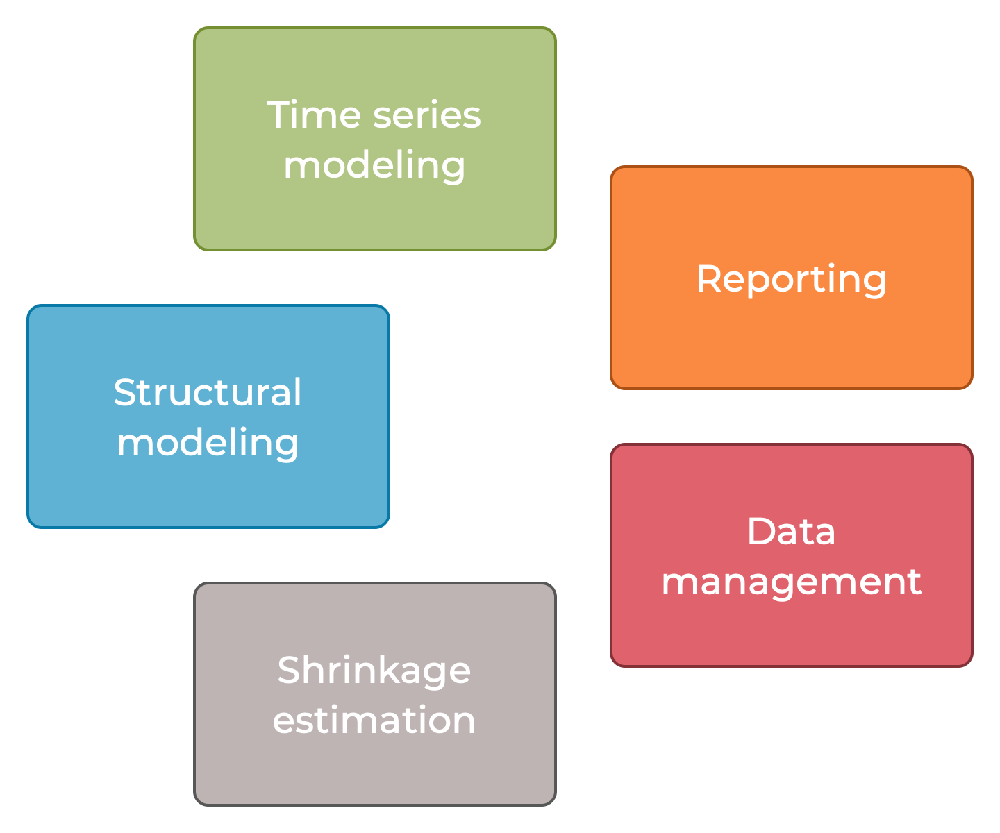

__Iris Toolbox for Macroeconomic Modeling__

# Key functional areas 

`jaromir.benes@iris-toolbox.com`

---

---

## Overview of structural modeling tools

Develop and operate systems of "structural" equations

* `Model`: Structural models including forward-looking nonlinear nonstationary models and DSGEs

* `Explanatory`: Systems of explanatory equations, including regression equations with ARMA errors, preprocessing and postprocessing equations

* `Slang`: Iris source language and preparser for writing model source codes with support for multi-file source, source code branching and looping

* `Plan`: Simulation plans, conditional simulations and forecasts, and model inversions

* `+blazer`: Steady-state sequential-block analyzer for optimizing the steady-state calculations in large models

---

## Overview of time series modeling tools

Explore shorter-term empirical correlations, deal with the overfitting problem in high-dimensional models

* `VAR`: Reduced-form vector autoregressions and panel vector autoregressions

* `SVAR`: Structural vector autoregressions

* `Dynafit`: Dynamic factor models

* `+x13`: Interface to X13-Arima-Tramo-Seats

*  Univariate filters for time series objects

---

## Overview of data management

Preprocess and postprocess time series and databanks (structs)

* `Dater` and `+dater`: Dates convenient for evenly spaced periodicities (daily, business-daily, weekly, monthly, quarterly, half-yearly, yearly, integer)

* `Series`: Time series (dynamic non-frame) manipulation

* `+databank`: Databanks, batch jobs, import/export from common formats

* Customizable databank serialization to `json`, `csv` formats

* Interface to public database APIs: `+databank.fromIMF`, `+databank.fromECB`, `+databank.fromFred` packages

---

## Overview of visualization and reporting

Visualize data on screen and create HTML reports

* `Chartpack`: Structured on-screen charting

* `+rephrase`: Standalone reports based on HTML/JS/CSS/JSON technology

* `+visual`: Utilities for styling on-screen visualization 

---

## Overview of shrinkage estimation techniques

Shrinkage estimators (bayesian)

* `+dummy`:  Prior dummy observations constructor for "BVAR" estimation

* `Posterior`: Posterior simulator

* `SystemPriorWrapper`, `SystemProperty`, `SystemPrior`:  System prior implementation for `Model` objects

* `+distribution`:  Common distribution package 
